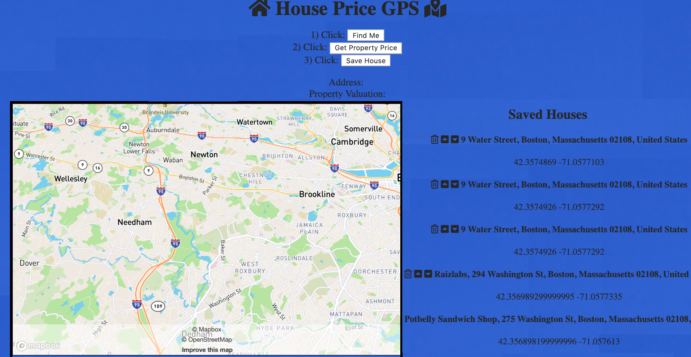

# 📷 House-Pricing-GPS-App

### Purpose:

- Full-stack app that allows users to find their location and find the price of the nearest house.
- Users can save their favorite houses.

## IDEA:
- look at REAL ESTATE Sites for CSS ideas/inspiration
- add Directions from INPUT, output Est Commute/Driving Time (ex. to work)/draw route
  https://docs.mapbox.com/mapbox-gl-js/example/mapbox-gl-directions/
  https://docs.mapbox.com/help/how-mapbox-works/directions/
- add setTimeOut / only one Activation Button (one fetch after the other)
  https://alligator.io/js/settimeout-setinterval/
- live route https://docs.mapbox.com/mapbox-gl-js/example/live-update-feature/
- add a marker/point https://docs.mapbox.com/mapbox-gl-js/example/drag-a-marker/

## TO DO:

_____________________________________________________
_____________________________________________________
_____________________________________________________
- ~!!! ADD BUTTONS FOR SPECIFIC ADDRESSES !!!~
_____________________________________________________
_____________________________________________________
_____________________________________________________
_____________________________________________________

- ADD MORE Data to save and show on house.ejs
- add Non-Logged In page
[landing page(index) enter=> Non-Logged In page => Logged in Page with Favorites and other functionality
]
- add CRUD...first, "Save House" BUTTON -
  - non-compliant:  save $$ and address in a ul
  - compliant: save coordinates and rawAddress and inputs for Zillow api
    (streetAddress, city, state)
- add CSS/background image
- add Media Queries and REMs
- add link to Zillow house's page
- add BUTTONS for preset addresses (demo day)

- add INPUT where you can input address to check price ZestimateAmt
- Restyle the Mapbox Logo Bar.
  Change the default position for attribution
  https://docs.mapbox.com/mapbox-gl-js/example/attribution-position/
- check price by using mouse to get latitude and longitude coordinates
  https://docs.mapbox.com/mapbox-gl-js/example/mouse-position/
- SCROLL THOUGH FAVORITES and FLY w/ MAP
  Fly to a location based on scroll position
  https://docs.mapbox.com/mapbox-gl-js/example/scroll-fly-to/
- add Navigation functionality (possible?)
- for Demo Day: add "Live Preview Trip"/"Simulation Trip"

- Clear price when searching new address

Design
-zillow app's map and layout
Check screenshot from 8/8

Functionalities
-marker/pointer for searched address
-marker/pointer for all favorites
-find coordinates/price by click on map

## Used Features
- Embed Code Generator | Embedly https://embed.ly/code
- Instant Street View https://www.instantstreetview.com/
- AARP Livability Index https://livabilityindex.aarp.org/
- 3D Buildings https://docs.mapbox.com/mapbox-gl-js/example/3d-buildings/
- Live Zoom https://docs.mapbox.com/mapbox-gl-js/example/change-building-color-based-on-zoom-level/
- Set pitch and bearing https://docs.mapbox.com/mapbox-gl-js/example/set-perspective/
- Fly to a location https://docs.mapbox.com/mapbox-gl-js/example/flyto/

## cool extras:
https://docs.mapbox.com/mapbox-gl-js/example/animate-point-along-route/
https://docs.mapbox.com/mapbox-gl-js/example/animate-camera-around-point/
https://docs.mapbox.com/mapbox-gl-js/example/game-controls/
https://docs.mapbox.com/mapbox.js/example/v1.0.0/custom-legend/
<!-- more mapbox features v1.0.0 in link below -->
https://docs.mapbox.com/mapbox.js/example/v1.0.0/marker-popup-onload/

## Bugs to Review:
- If can't save Zestimate, save Coordinates as Favorites and show Zestimate onclick of "Get Property Price" Button
- "Get Property Price" Button" should FLY to selected coordinates and not only zoom
  - create f(x) zoom and f(x) fly and if...then statement for were Zillow fetch is called from ( if from FAV List, then FLY, else ZOOM)

- Reverse Geocoding may return "name" of place in addition to street address, interfering with naming system.
- rawAddress: Emerson College Journalism, 120 Boylston St, Boston, Massachusetts 02116, United States
  streetAddress: Emerson College Journalism
  city: 120 Boylston St
  state: Boston

### References:
- Fetching and Reading XML Data (6:23) https://www.youtube.com/watch?v=MDAWie2Sicc
- https://developer.mozilla.org/en-US/docs/Web/Guide/Parsing_and_serializing_XML
- https://developer.mozilla.org/en-US/docs/Web/XPath
- https://developer.mozilla.org/en-US/docs/Web/JavaScript/Introduction_to_using_XPath_in_JavaScript
- https://developer.mozilla.org/en-US/docs/Archive/JXON
- https://developer.mozilla.org/en-US/docs/Web/API/Body/json
- Prevent CORS error https://github.com/Rob--W/cors-anywhere/#client
  Add https://cors-anywhere.herokuapp.com/ before fetched URL
- HTML5 Geolocation https://developer.mozilla.org/en-US/docs/Web/API/Geolocation_API
# FinalProj-house-pricing-gps-CliffWk
